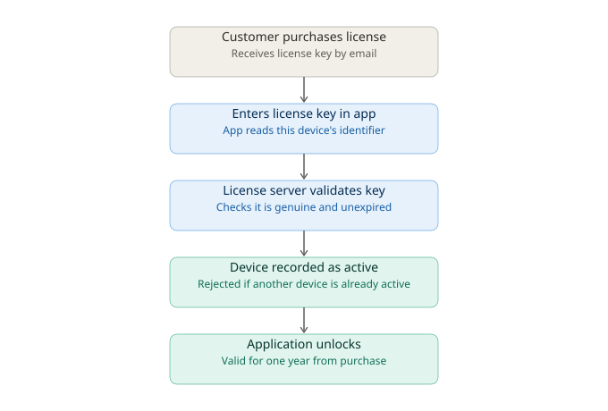
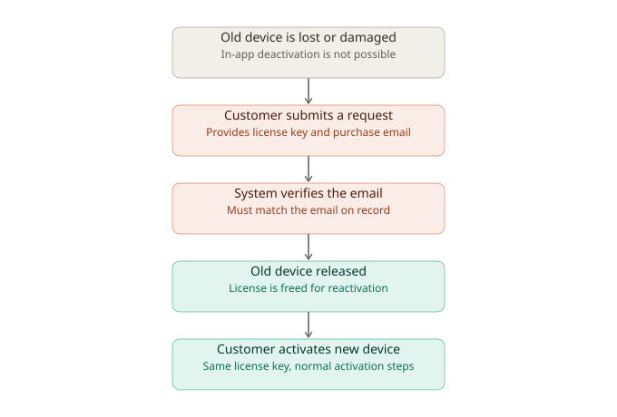

# Software Licensing: How It Works and How to Implement It

## Yearly, Single-User License Model

---

## 1. What Is Software Licensing

Software licensing is the system that controls who is allowed to use your application, on how many devices, and for how long. When a customer buys your software, they are not buying the code itself, they are buying permission to use it under certain terms. The licensing system is what checks and enforces those terms every time the application runs.

For your case, the terms are simple:

- One license belongs to one paying customer
- The license can be active on only one device at a time
- The license is valid for one year from the date of purchase
- The customer must renew every year to keep using the software

---

## 2. The Core Idea

Every licensing system, no matter how complex, is answering three questions each time the app starts:

1. Is this a genuine, unmodified license, not something faked or copied
2. Is this license still within its valid time period
3. Is this the one device this license is allowed to run on

If the answer to all three is yes, the app unlocks. If any answer is no, the app should restrict or block usage and prompt the customer to fix the issue (renew, reactivate, contact support).

---

## 3. Main Components Needed

### 3.1 License Key

A unique code generated for each customer at the time of purchase. This is what the customer enters into the application the first time they use it.

### 3.2 License Server

A central system, hosted by you, that keeps records of every license: who owns it, when it was issued, when it expires, and which device it is currently activated on. This is the single source of truth. All activation and renewal decisions go through this server.

### 3.3 License File on the Customer's Device

Once a license is activated, the application stores a small file locally that proves the license is valid. This file lets the app confirm the license without needing to contact the server every single time it opens, which also allows the software to keep working for short periods without internet access.

### 3.4 Device Identifier

A value generated from characteristics of the customer's computer, used to recognize that specific machine. This is what allows the system to say "this license is tied to this one computer" and refuse activation on a second one.

### 3.5 Expiry Date

The date exactly one year after issue or purchase, stored as part of the license record. The application checks the current date against this value to decide whether the license is still valid.

---

## 4. How Activation Works

1. Customer purchases the software and receives a license key, usually by email.
2. Customer installs the application and enters the license key.
3. The application contacts the license server, sending the license key along with an identifier for the current device.
4. The server checks whether the key exists, is unexpired, and is not already active on a different device.
5. If everything checks out, the server marks that device as the active device for this license and sends back confirmation.
6. The application stores this confirmation locally so it can keep validating the license going forward.

If the customer later tries to activate the same key on a second device while the first device is still marked active, the activation should be rejected. This is what enforces the single-user, single-device rule.

### Activation flow diagram

---

## 5. How Expiry and Renewal Work

Because the license carries an expiry date, the application simply compares today's date against that expiry date each time it runs, or at regular intervals.

- Some time before expiry (for example, 30 days), the application should show a renewal reminder.
- After the customer renews and pays for another year, the license server extends the expiry date by one year.
- The application picks up this updated expiry date the next time it checks in with the server.
- If the license passes its expiry date without renewal, the application should restrict use until renewal is completed. A short grace period after expiry is common practice, so customers are not locked out abruptly the moment the date passes.

---

## 6. Handling a Damaged or Replaced Machine

Since the license is tied to one device, a real-world problem arises when that device is lost, damaged, or replaced. The customer will have a new machine but the same license key, and the old device can no longer be reached to release it.

The recommended approach for this situation:

1. The customer requests a device change through a support or self-service page, not through a button inside the application itself, since the old device may be inaccessible or destroyed.
2. The customer provides their license key and the email address associated with the purchase.
3. The system verifies that the email address matches the one on record for that license key.
4. Once verified, the system releases the license from the old device record, allowing it to be activated fresh on a new device.
5. The customer then enters the same license key on the new machine, and normal activation proceeds as described in Section 4.

This keeps control of deactivation outside the application itself, and ties it to proof of ownership (the license key plus the matching email), rather than relying on access to the old, possibly broken, machine.

### Device change flow diagram

---

## 7. Requirements Summary

**Functional requirements**

- Generate a unique license key for every purchase
- Record customer email, purchase date, and expiry date against each license
- Restrict each license to one active device at a time
- Verify license validity when the application starts, and periodically afterward
- Allow renewal to extend the expiry date by one year
- Allow the customer to request release of a license from an old device using their license key and email, without needing access to the old device
- Show renewal reminders before expiry, and restrict functionality after expiry if not renewed

**Non-functional requirements**

- The application should be able to confirm license validity for short periods without an internet connection
- License data and checks should be difficult to tamper with or forge
- The activation and deactivation process should be simple enough for non-technical customers to complete on their own
- The system should log activation and deactivation events for support and fraud-monitoring purposes

---

## 8. Summary

A yearly, single-user license system works by issuing a unique key per customer, tying that key to one device through an activation process, storing an expiry date exactly one year out, and checking that date on an ongoing basis. Renewal simply extends the expiry date. Device changes, including cases where the original device is damaged and unreachable, are handled outside the application through email verification against the license record, rather than through an in-app control tied to the old device.